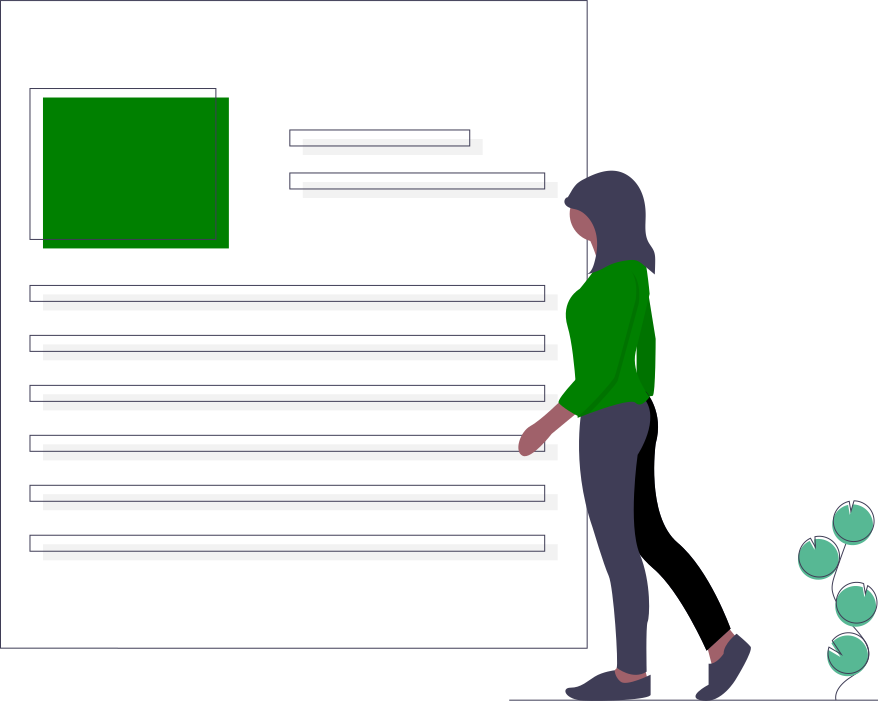

- Usa **rem en vez de px** para definir el tamaño de fuente. [ver fuentes](#fuentes)
- Utiliza el atributo **lang** para que los lectores adapten la pronunciación. 
    ```html 
        ... y gritó, <span lang="fr">c'est fini!</span>
    ```
- No bloquear el zoom, [ver metatags](#metatags)
- Utiliza un lenguaje sencillo y evita las figuras retóricas, los modismos y las metáforas complicadas.
- Utiliza texto alineado a la izquierda para idiomas de izquierda a derecha ( LTR ) y texto alineado a la derecha para idiomas de derecha a izquierda ( RTL ).
- **Evita usar scroll infinito**, si lo utilizas ofrece una alternativa. Es frustrante querer acceder a un elemento que esté al final de una lista larga o intentar llegar al pie de página y no poder 😠.
- En determinados casos, es útil usar enlaces del tipo ***"Saltar al contenido principal"***, que lleven al usuario al comienzo del contenido principal. Este truco es útil para webs que no tienen definidos las distintas secciones con ARIA

## Metatags

- **lang**, debemos especificar un idioma:
    ```html
        <html lang="en">
    ```
- **viewport** - nunca bloquear el zoom, no uses:
    - `user-scalable=no`
    - `maximum-scale=1.0`
    - la forma correcta de uso de viewport sería la siguiente:

    ```html
        <meta name="viewport" content="width=device-width, initial-scale=1.0">
    ```


## Fuentes

- No uses scroll infinito ! - 
-off-screen items

height: 0, transform: translateX(-100%)

tabindex order


## Listas

- Utiliza el marcado correcto para las listas `<ul>, <ol>, <dt>`, así los lectores de pantalla las identificarán y sabrán cuántos elementos tiene. 

### Tipos de listas

- Lista desordenada, esta lista se representa como una lista con viñetas de elementos.
    ```html 
        <ul>
            <li>Manzanas</li>
            <li>Peras</li>
            <li>Limones</li>
        </ul>
    ```
- Lista ordenada (`<ol>`): esta lista se representa como una lista numerada de elementos (cada uno etiquetado con `<li>`).
- Lista de definiciones (`<dl>`): esta lista se representa como pares de términos (`<dt>`) y descripciones (`<dd>`).