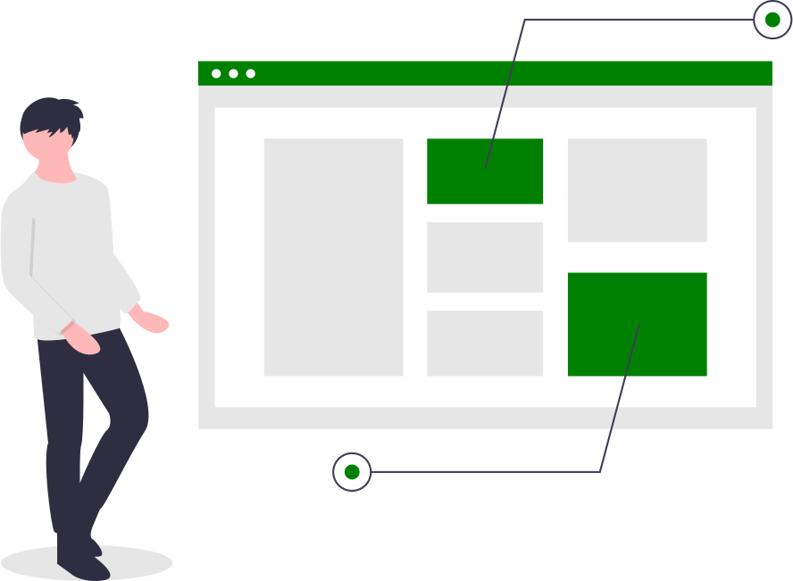

Las secciones de nuestro sitio debemos organizarlas mediante un **marcado semántico**. La semántica literalmente significa usar un lenguaje “significativo”, en HTML disponemos de una serie de etiquetas (tags) de marcado semántico que nos ayudan a describir el contenido.

Estas son algunas de las etiquetas de contenido que podemos usar en nuestro sitio:

`header, nav, main, article, aside, address, footer`

Ejemplo de estructura semántica:

```html
	<header>
		
		<nav>
			<!-- menú principal -->
		</nav>
	</header>


	<aside>
		<nav>
			<!-- menú secundario -->
		</nav>
	</aside>

	<main>
		<section>
			<header>Título sección presentación</header>
		</section>

		<section>
			<header>Titulo sección artículos</header>
			<article>
				<header>
					<h1> Titulo artículo 1 </h1>
				<header>
			</article>
				<header>
					<h1> Titulo artículo 2 </h1>
				</header>
			<article>
		</section>
	</main>

	<footer>
	</footer>

```

## Header

El header es la primera zona que nos encontramos en cada página, y contiene información común, como puede ser el logotipo del sitio web, la función de búsqueda y las opciones de navegación.

```html
<header>
  
</header>

<!-- main -->

<!-- footer -->
```

## Nav

Se utiliza para determinar la **navegación principal** de la página.

En el caso de tener varios menús de navegación, por ejemplo uno en la cabecera y otro en el pie, deberíamos usar el atributo **aria-labelledby**, para que los lectores de pantalla sepan distinguir el tipo de navegación.

```html
<header>
  <!-- contenido header -->

  <nav aria-labelledby="menu-principal">
    <h2 id="menu-principal">Menu de navegación principal</h2>
    <!-- elementos del menú -->
  </nav>
</header>

<!-- main -->

<footer>
  <nav aria-labelledby="menu-secundario">
    <h2 id="menu-secundario">Menú de navegación secundario</h2>
    <!-- elementos del menú -->
  </nav>
</footer>
```

## Main

La etiqueta main indica el contenido principal, esta etiqueta debe ser única por página.

```html
<!-- header -->

<main>
  <!-- contenido principal -->
</main>

<!-- footer -->
```

## Aside

Son secciones que podrían ir en el contenido principal, pero pueden ser separadas y significativas por sí mismas; Por ejemplo, una nota al margen explicando o anotando el contenido principal.

## Footer

Al igual que el encabezado, es un área con la misma información en todas las páginas, se suele colocar la información legal, privacidad, redes sociales o enlaces de navegación.

## Article

La etiqueta article define un **contenido independiente y autónomo**, es decir fuera del contexto de la web seguiría teniendo significado.

Ejemplos de uso

- Noticias
- Entrada de un blog

```html
<article role="article">
  <header>
    <h2>Mi opinión sobre el mundo</h2>
  </header>
  <section class="content">
    <p>Aquí voy hablar de lo maravilloso que es el mundo.</p>
  </section>
  <section class="comments">
    <div class="comment" role="article">
      <p>Increible post</p>
    </div>
    <div class="comment" role="article">
      <p>Me gusta como sintetizas</p>
    </div>
  </section>
</article>
```

## Section

Se utiliza para definir una sección, es similar a un div, pero con carácter semántico. Los lectores de pantalla lo identifican como una región.
