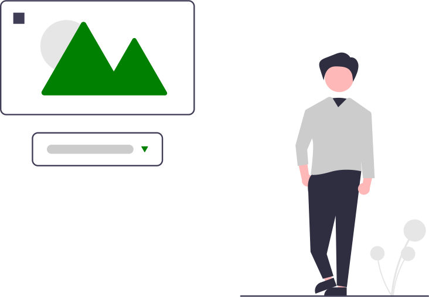

 

- **Todas las imágenes deben tener el atributo alt**, en caso de imagenes decorativas, debe estar vacio.
- El texto alternativo debe transmitir la mayor información sobre la imagen, sin superar los 125 caracteres.
- En caso de descripciones muy largas, usaremos el atributo [longdesc](https://www.w3.org/TR/WCAG20-TECHS/H45.html)
- Imágenes funcionales deben llevar en el **alt la acción que realizan**.
- Si la imagen tiene información compleja, como gráficos, se debe añadir breve texto identificativo y, a continuación la descripción detallada de la información debe ser proporcionada en otros lugares (por ejemplo, en una tabla de datos).
- Si la imagen está suficientemente descrita en el texto - por ejemplo, un simple diagrama que ilustra lo que está escrito en el texto de la página web puede tener breve texto alternativo como "Diagrama de flujo de trabajo como se ha descrito anteriormente.”, o bien dejar vacío el texto alternativo.
